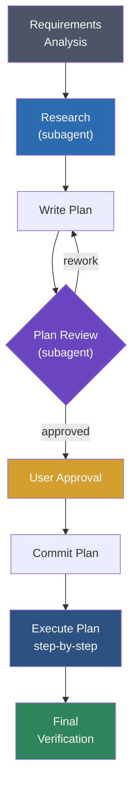
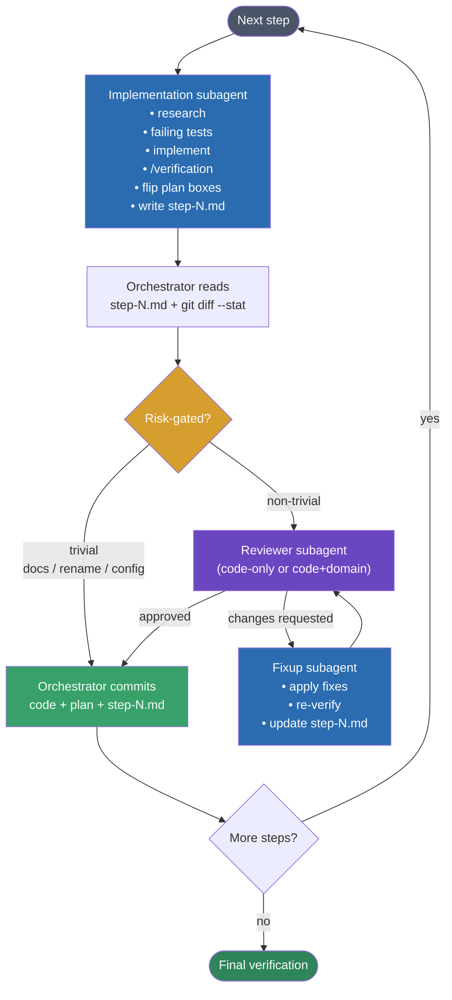

# claude-sweatshop

A Claude Code plugin that orchestrates multi-agent workflows
for day-to-day development. It breaks large tasks into
researched, planned, reviewed, and incrementally implemented
steps — each committed atomically with test-driven
development.

Inspired by [superpowers](https://github.com/obra/superpowers).

## Installation

### From the Claude Code marketplace

```bash
claude plugin install POPFD/claude-sweatshop
```

### From source

```bash
git clone git@github.com:POPFD/claude-sweatshop.git
claude plugin install --source ./claude-sweatshop
```

## Getting started

Run the onboard skill in your project to set up the
`.sweatshop/` directory, auto-detect your toolchains (build,
test, lint), and configure the domain expert:

```
/onboard
```

## Usage

### Starting new work

Kick off a feature or significant change with requirements
analysis, which drives the full pipeline:

```
/requirements-analysis Add pagination to the /users API endpoint
/requirements-analysis Fix the race condition in the webhook handler
```

### Individual workflow steps

Use skills directly when you only need a specific part of
the pipeline:

```
/research How does the auth middleware work?
/writing-plans Refactor the database layer to use connection pooling
/requesting-review Check the last commit for issues
/executing-plans Execute the current approved plan
```

### Toolchain skills

Run common dev tasks with auto-detection of your toolchain:

```
/build
/test
/lint
/commit-changes
```

## How it works

The plugin coordinates a pipeline of specialized agents and
skills. The main thread acts as an **orchestrator** — it
delegates heavyweight work (codebase exploration, edits, test
runs) to subagents so context stays clean across long plans.

### Overall pipeline



### Per-step execution (orchestrator + subagents)

For each plan step, the main thread orchestrates while
specialized subagents do the work. Step notes
(`.sweatshop/plans/<name>/step-<N>.md`) are the durable
handoff between subagents and survive context compaction.



Subagents (blue/purple) run in isolated contexts and report a
≤3-line summary back to the orchestrator — diffs and test
output never enter the main thread.

### 1. Requirements analysis

New features start with a structured dialogue. The plugin
surveys the project, evaluates the task against constraints
(performance, scalability, security, compatibility), and asks
focused questions one at a time to fill gaps. It then
compares viable approaches with trade-offs and walks through
the design piece by piece. No code is written until the user
explicitly approves the design.

### 2. Research

The researcher agent investigates both the codebase and
external sources. It searches for relevant code, patterns,
architecture, dependencies, prior art, documentation, best
practices, and known pitfalls. The output is a structured
report covering task understanding, codebase findings,
external findings, and recommendations.

### 3. Planning

Work is broken into small, incremental, decoupled steps —
each producing an atomic, reviewable commit. Every step
includes a description, rationale, acceptance criteria
(as checkboxes), and a list of files likely involved. Plans
are saved to `.sweatshop/plans/` and committed before
execution begins.

### 4. Review (plans and code)

Plans and non-trivial code steps go through a single
`reviewer` agent run that produces both a general code
review and (when in scope) a domain review in one
exploration pass. The mode is picked per-invocation:

- **`code-only`** — used when the diff is docs-only,
  test-only, a pure rename/format refactor, or changes only
  files outside the configured `domain.paths`. Produces a
  principal-engineer code review covering design,
  performance, scalability, and alignment with research.
- **`code+domain`** — used when any changed file matches
  `domain.paths` (or, in fallback mode, when domain-specific
  invariants are plausibly affected). Adds a domain section
  driven by the `focus_areas` configured during onboarding
  (e.g., crypto/DeFi, frontend, ML, distributed systems).

Trivial steps (pure docs, mechanical renames, config-only
edits with no runtime effect) skip review entirely. If any
verdict requests changes, a **fixup subagent** applies the
fixes and re-runs verification before re-review — up to 3
iterations before escalating to the user.

### 5. Execution (orchestrator + subagents, TDD per step)

The `/executing-plans` skill walks the plan one step at a
time, strictly in plan order. The main thread is an
**orchestrator** — it never implements directly. Per step:

1. **Implementation subagent** runs the full TDD loop in its
   own context: optional `/research`, failing tests, minimum
   implementation, `/verification` (build + test + lint),
   flips the plan's `- [ ]` boxes, and writes the step-notes
   file.
2. **Orchestrator reads only step notes** plus
   `git diff --stat` — diffs and test output stay out of the
   main thread.
3. **Risk-gated review** — the orchestrator skips review for
   trivial steps; otherwise dispatches the `reviewer` agent
   (with the mode chosen from `domain.paths`).
4. **Fixup subagent** applies any blocking review feedback
   and updates the step-notes "Review resolutions" section.
   Then re-review. Max 3 cycles.
5. **Atomic commit** — orchestrator commits code, updated
   `plan.md`, and the step-notes file together.

Step notes are the durable handoff: they survive context
compaction, so a fresh session mid-plan can re-orient just
by listing `step-*.md` files. If a step fails repeatedly and
cannot be resolved, execution stops and the issue is
surfaced — no further steps run until the plan is adjusted
and re-approved.

### 6. Verification

After all steps complete, a final verification pass runs
build, test, and lint against the full project, confirms
every acceptance criterion is checked off, and verifies no
uncommitted changes remain.

## Agents

| Agent | Role |
|-------|------|
| `researcher` | Deep-dives into the codebase and external sources to build task context |
| `reviewer` | Principal-engineer code review plus per-project domain review in a single pass |

## Skills

| Skill | Description |
|-------|-------------|
| `/onboard` | Sets up `.sweatshop/`, detects toolchains, and configures the domain expert |
| `/requirements-analysis` | Structured dialogue to surface requirements before any implementation |
| `/research` | Dispatches the researcher agent for deep codebase and external context |
| `/writing-plans` | Breaks work into small steps with acceptance criteria |
| `/executing-plans` | Walks through an approved plan step by step with TDD and review gates |
| `/requesting-review` | Dispatches the reviewer with code-only or code+domain mode based on the diff |
| `/verification` | Runs build, test, lint and confirms all acceptance criteria are met |
| `/build` | Auto-detects the build system and runs it |
| `/test` | Auto-detects the test framework and runs tests |
| `/lint` | Auto-detects the linter and runs it |
| `/commit-changes` | Stages and commits with conventional message formatting and signoff |

## Toolchain auto-detection

The `/onboard`, `/build`, `/test`, and `/lint` skills
auto-detect your project's toolchain by checking for config
files in priority order. Detected commands are cached in
`.sweatshop/memory.json` with a config file hash so
re-detection only happens when your config changes. Domain
configuration (type, focus areas, review criteria) is stored
separately in `.sweatshop/domain.json` and checked into
version control.

Supported build systems: Make, Cargo, npm/yarn/pnpm, Go,
.NET, Gradle, Maven, CMake, Meson.

Supported test frameworks: make test, cargo test, npm test,
go test, dotnet test, gradle test, mvn test, pytest.

Supported linters: make lint, cargo clippy, npm run lint,
golangci-lint, dotnet format, gradle check, mvn checkstyle,
ruff, flake8, pylint.

## License

MIT — see [LICENSE](LICENSE).
