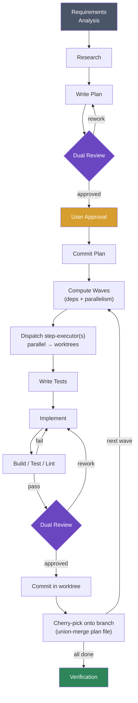

# claude-sweatshop

A Claude Code plugin that orchestrates multi-agent workflows
for day-to-day development. It breaks large tasks into
researched, planned, reviewed, and incrementally implemented
steps — each committed atomically with test-driven
development.

Inspired by [superpowers](https://github.com/obra/superpowers).

## Installation

### From the Claude Code marketplace

```bash
claude plugin install POPFD/claude-sweatshop
```

### From source

```bash
git clone git@github.com:POPFD/claude-sweatshop.git
claude plugin install --source ./claude-sweatshop
```

## Getting started

Run the onboard skill in your project to set up the
`.sweatshop/` directory, auto-detect your toolchains (build,
test, lint), and configure the domain expert:

```
/onboard
```

## Usage

### Starting new work

Kick off a feature or significant change with requirements
analysis, which drives the full pipeline:

```
/requirements-analysis Add pagination to the /users API endpoint
/requirements-analysis Fix the race condition in the webhook handler
```

### Individual workflow steps

Use skills directly when you only need a specific part of
the pipeline:

```
/research How does the auth middleware work?
/writing-plans Refactor the database layer to use connection pooling
/requesting-review Check the last commit for issues
/executing-plans Execute the current approved plan
```

### Toolchain skills

Run common dev tasks with auto-detection of your toolchain:

```
/build
/test
/lint
/commit-changes
```

## How it works

The plugin coordinates a pipeline of specialized agents and
skills. The full workflow looks like this:



### 1. Requirements analysis

New features start with a structured dialogue. The plugin
surveys the project, evaluates the task against constraints
(performance, scalability, security, compatibility), and asks
focused questions one at a time to fill gaps. It then
compares viable approaches with trade-offs and walks through
the design piece by piece. No code is written until the user
explicitly approves the design.

### 2. Research

The researcher agent investigates both the codebase and
external sources. It searches for relevant code, patterns,
architecture, dependencies, prior art, documentation, best
practices, and known pitfalls. The output is a structured
report covering task understanding, codebase findings,
external findings, and recommendations.

### 3. Planning

Work is broken into small, incremental, decoupled steps —
each producing an atomic, reviewable commit. Every step
includes a description, rationale, acceptance criteria
(as checkboxes), a list of files likely involved, and two
metadata fields the executor uses to parallelize work:

- **Depends on** — prior step numbers that must land first.
- **Parallelizable** — whether the step can run concurrently
  with its wave-mates. Defaults to `yes` when there are no
  dependencies.

Plans are saved to `.sweatshop/plans/` and committed before
execution begins.

### 4. Review (plans and code)

Every plan and every implementation step goes through a dual
review gate. Two agents run in parallel:

- **Code reviewer** — a principal engineer evaluating design
  quality, scalability, performance, technology choices, and
  alignment with research findings.
- **Domain expert** — auto-configured during onboarding
  based on the project's domain (e.g., crypto/DeFi, frontend,
  ML, distributed systems). Catches domain-specific pitfalls
  that a general code review would miss.

If either reviewer requests changes, feedback is applied and
re-reviewed (up to 3 iterations before escalating to the
user).

### 5. Execution (TDD per step, parallelized by wave)

The `/executing-plans` skill is a thin **orchestrator**. It
never writes code itself — it dispatches each step to a
`step-executor` subagent so the main conversation's context
stays small even on long runs.

The orchestrator walks the plan's dependency graph and
groups steps into **waves**: sets of steps whose
dependencies are all already landed. Within a wave,
parallelizable steps are dispatched concurrently, each in
its own **git worktree** branched off the current HEAD. When
the wave finishes, the orchestrator cherry-picks each
worktree's commits back onto the branch in plan order.

Inside each step-executor, the old per-step sequence still
applies:

1. **Write tests first** — tests that verify the step's
   acceptance criteria (they should fail initially)
2. **Implement** — minimum code to make the tests pass
3. **Build / Test / Lint** — all three must pass; failures
   are fixed before proceeding
4. **Update the plan** — mark acceptance criteria as complete
5. **Review** — dual review gate on the step's changes
6. **Commit** — atomic commit including code and updated plan

Cross-step integration is handled by the orchestrator:

- **Cherry-pick order** follows plan step numbers so the
  history stays readable.
- **Plan-file conflicts** (two worktrees flipping different
  checkboxes in the same file) are auto-resolved by unioning
  the `[x]` marks.
- **Code-file conflicts** in a parallel wave mean the steps
  were not actually independent; the orchestrator aborts the
  cherry-pick and surfaces the issue so the plan can be
  revised.
- **Failures** from any step-executor stop the pipeline
  before partial results are cherry-picked.

### 6. Verification

After all steps complete, a final verification pass runs
build, test, and lint against the full project, confirms
every acceptance criterion is checked off, and verifies no
uncommitted changes remain.

## Agents

| Agent | Role |
|-------|------|
| `researcher` | Deep-dives into the codebase and external sources to build task context |
| `code-reviewer` | Principal engineer reviewing design, scalability, performance, and architecture |
| `domain-expert` | Domain-specific reviewer auto-configured per project during onboarding |
| `step-executor` | Owns a single plan step end-to-end (TDD → build/test/lint → review → commit), dispatched per-step by the executing-plans orchestrator (in a worktree for parallel waves) |

## Skills

| Skill | Description |
|-------|-------------|
| `/onboard` | Sets up `.sweatshop/`, detects toolchains, and configures the domain expert |
| `/requirements-analysis` | Structured dialogue to surface requirements before any implementation |
| `/research` | Dispatches the researcher agent for deep codebase and external context |
| `/writing-plans` | Breaks work into small steps with acceptance criteria |
| `/executing-plans` | Walks through an approved plan step by step with TDD and review gates |
| `/requesting-review` | Dispatches code-reviewer and domain-expert in parallel |
| `/verification` | Runs build, test, lint and confirms all acceptance criteria are met |
| `/build` | Auto-detects the build system and runs it |
| `/test` | Auto-detects the test framework and runs tests |
| `/lint` | Auto-detects the linter and runs it |
| `/commit-changes` | Stages and commits with conventional message formatting and signoff |

## Toolchain auto-detection

The `/onboard`, `/build`, `/test`, and `/lint` skills
auto-detect your project's toolchain by checking for config
files in priority order. Detected commands are cached in
`.sweatshop/memory.json` with a config file hash so
re-detection only happens when your config changes. Domain
configuration (type, focus areas, review criteria) is stored
separately in `.sweatshop/domain.json` and checked into
version control.

Supported build systems: Make, Cargo, npm/yarn/pnpm, Go,
.NET, Gradle, Maven, CMake, Meson.

Supported test frameworks: make test, cargo test, npm test,
go test, dotnet test, gradle test, mvn test, pytest.

Supported linters: make lint, cargo clippy, npm run lint,
golangci-lint, dotnet format, gradle check, mvn checkstyle,
ruff, flake8, pylint.

## License

MIT — see [LICENSE](LICENSE).
