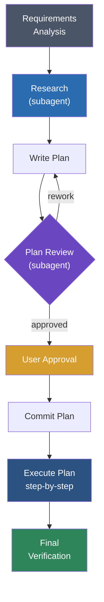
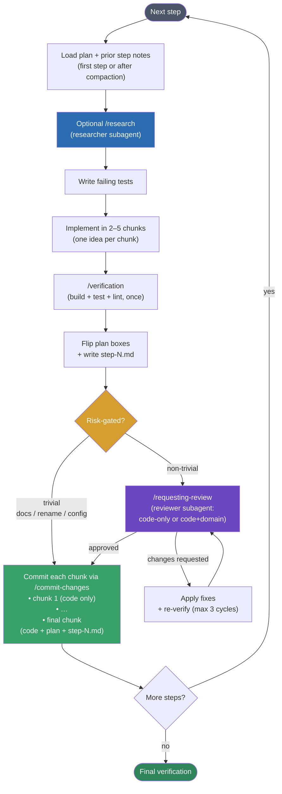

# claude-sweatshop

A Claude Code plugin that orchestrates multi-agent workflows
for day-to-day development. It breaks large tasks into
researched, planned, reviewed, and incrementally implemented
steps — each landing as a series of small, human-readable
commits driven by test-driven development.

Inspired by [superpowers](https://github.com/obra/superpowers).

## Installation

### From the Claude Code marketplace

```bash
claude plugin install POPFD/claude-sweatshop
```

### From source

```bash
git clone git@github.com:POPFD/claude-sweatshop.git
claude plugin install --source ./claude-sweatshop
```

## Getting started

Run the onboard skill in your project to set up the
`.sweatshop/` directory, auto-detect your toolchains (build,
test, lint), and configure the domain expert:

```
/onboard
```

## Usage

### Starting new work

Kick off a feature or significant change with requirements
analysis, which drives the full pipeline:

```
/requirements-analysis Add pagination to the /users API endpoint
/requirements-analysis Fix the race condition in the webhook handler
```

### Individual workflow steps

Use skills directly when you only need a specific part of
the pipeline:

```
/research How does the auth middleware work?
/writing-plans Refactor the database layer to use connection pooling
/requesting-review Check the last commit for issues
/executing-plans Execute the current approved plan
```

### Toolchain skills

Run common dev tasks with auto-detection of your toolchain:

```
/build
/test
/lint
/commit-changes
```

## How it works

The plugin coordinates a pipeline of skills. It calls out to
specialized subagents for the two read-heavy jobs —
codebase/external **research** and code **review** — so their
large contexts never enter the main thread. Everything else,
including the per-step TDD loop (tests, edits, verification,
commits), runs in the main thread one plan step at a time.

### Overall pipeline


```mermaid
flowchart TD
    A["Requirements<br/>Analysis"] --> B["Research<br/>(subagent)"]
    B --> C["Write Plan"]
    C --> D{"Plan Review<br/>(subagent)"}
    D -->|rework| C
    D -->|approved| E["User Approval"]
    E --> F["Commit Plan"]
    F --> G["Execute Plan<br/>step-by-step"]
    G --> L["Final<br/>Verification"]

    style A fill:#4a5568,color:#fff
    style B fill:#2b6cb0,color:#fff
    style D fill:#6b46c1,color:#fff
    style E fill:#d69e2e,color:#fff
    style G fill:#2c5282,color:#fff
    style L fill:#2f855a,color:#fff
```

### Per-step execution (TDD loop)

Each plan step runs its full test-driven loop in the main
thread, calling out to a subagent only for optional research
and for the review gate. Step notes
(`.sweatshop/plans/<name>/step-<N>.md`) are the durable handoff
that survives context compaction.


```mermaid
flowchart TD
    Start(["Next step"]) --> Ctx["Load plan + prior step notes<br/>(first step or after compaction)"]
    Ctx --> Res["Optional /research<br/>(researcher subagent)"]
    Res --> Tests["Write failing tests"]
    Tests --> Impl["Implement in 2–5 chunks<br/>(one idea per chunk)"]
    Impl --> Verify["/verification<br/>(build + test + lint, once)"]
    Verify --> Notes["Flip plan boxes<br/>+ write step-N.md"]
    Notes --> Risk{"Risk-gated?"}
    Risk -->|trivial<br/>docs / rename / config| Commit
    Risk -->|non-trivial| Review["/requesting-review<br/>(reviewer subagent:<br/>code-only or code+domain)"]
    Review -->|approved| Commit["Commit each chunk via /commit-changes<br/>• chunk 1 (code only)<br/>• …<br/>• final chunk<br/>(code + plan + step-N.md)"]
    Review -->|changes requested| Fix["Apply fixes<br/>+ re-verify (max 3 cycles)"]
    Fix --> Review
    Commit --> Next{"More steps?"}
    Next -->|yes| Start
    Next -->|no| Done(["Final verification"])

    style Start fill:#4a5568,color:#fff
    style Res fill:#2b6cb0,color:#fff
    style Review fill:#6b46c1,color:#fff
    style Risk fill:#d69e2e,color:#fff
    style Commit fill:#38a169,color:#fff
    style Done fill:#2f855a,color:#fff
```

Only research and review (blue/purple) run as subagents in
isolated contexts; the rest of the loop runs in the main
thread. Step notes carry forward anything later steps need, so
a fresh session mid-plan can re-orient just by reading
`step-*.md`.

### 1. Requirements analysis

New features start with a structured dialogue. The plugin
surveys the project, evaluates the task against constraints
(performance, scalability, security, compatibility), and asks
focused questions one at a time to fill gaps. It then
compares viable approaches with trade-offs and walks through
the design piece by piece. No code is written until the user
explicitly approves the design.

### 2. Research

The researcher agent investigates both the codebase and
external sources. It searches for relevant code, patterns,
architecture, dependencies, prior art, documentation, best
practices, and known pitfalls. The output is a structured
report covering task understanding, codebase findings,
external findings, and recommendations.

### 3. Planning

Work is broken into small, incremental, decoupled steps —
each landing during execution as a coherent series of small,
reviewable commits. Every step includes a description,
rationale, acceptance criteria (as checkboxes), and a list of
files likely involved. Plans are saved to `.sweatshop/plans/`
and committed before execution begins.

### 4. Review (plans and code)

Plans and non-trivial code steps go through a single
`reviewer` agent run that produces both a general code
review and (when in scope) a domain review in one
exploration pass. The mode is picked per-invocation:

- **`code-only`** — used when the diff is docs-only,
  test-only, a pure rename/format refactor, or changes only
  files outside the configured `domain.paths`. Produces a
  principal-engineer code review covering design,
  performance, scalability, and alignment with research.
- **`code+domain`** — used when any changed file matches
  `domain.paths` (or, in fallback mode, when domain-specific
  invariants are plausibly affected). Adds a domain section
  driven by the `focus_areas` configured during onboarding
  (e.g., crypto/DeFi, frontend, ML, distributed systems).

Trivial steps (pure docs, mechanical renames, config-only
edits with no runtime effect) skip review entirely. If any
verdict requests changes, the fixes are applied and
verification re-runs before re-review — up to 3 iterations
before escalating to the user.

### 5. Execution (TDD per step)

The `/executing-plans` skill walks the plan one step at a
time, strictly in plan order. Each step runs its full
test-driven loop in the main thread:

1. **Load context only when needed** — re-read `plan.md` and
   prior `step-*.md` notes on the first step of a session or
   after auto-compaction; otherwise the conversation already
   holds them, and re-reading is the dominant token cost.
2. **Gather context** — optionally invoke `/research` if the
   step touches unfamiliar code.
3. **Tests first** — write failing tests for the step's
   acceptance criteria.
4. **Implement in chunks** — the minimum code, split into
   2–5 coherent chunks (one idea per chunk), scoped to this
   step only.
5. **Verify** — invoke `/verification` once; it runs build +
   test + lint over the end-state as a single pass.
6. **Update plan + notes** — flip this step's `- [ ]` boxes
   and write the step-notes file.
7. **Risk-gated review** — skip review for trivial steps
   (docs, mechanical renames, config-only); otherwise invoke
   `/requesting-review` (with the mode chosen from
   `domain.paths`). If review requests changes, apply fixes,
   re-verify, and re-review — max 3 cycles before escalating.
8. **Chunked commits** — invoke `/commit-changes` once per
   chunk so each commit reads as a single coherent change a
   human can skim. Earlier chunks are code-only; the final
   chunk of the step bundles the updated `plan.md` and the
   step-notes file alongside its code so the step still lands
   atomically.

Step notes are the durable handoff: they survive context
compaction, so a fresh session mid-plan can re-orient just
by listing `step-*.md` files. If a step fails repeatedly and
cannot be resolved, execution stops and the issue is
surfaced — no further steps run until the plan is adjusted
and re-approved.

### 6. Verification

After all steps complete, a final verification pass runs
build, test, and lint against the full project, confirms
every acceptance criterion is checked off, and verifies no
uncommitted changes remain.

## Agents

| Agent | Role |
|-------|------|
| `researcher` | Deep-dives into the codebase and external sources to build task context |
| `reviewer` | Principal-engineer code review plus per-project domain review in a single pass |

## Skills

| Skill | Description |
|-------|-------------|
| `/onboard` | Sets up `.sweatshop/`, detects toolchains, and configures the domain expert |
| `/requirements-analysis` | Structured dialogue to surface requirements before any implementation |
| `/research` | Dispatches the researcher agent for deep codebase and external context |
| `/writing-plans` | Breaks work into small steps with acceptance criteria |
| `/executing-plans` | Walks through an approved plan step by step with TDD and review gates |
| `/requesting-review` | Dispatches the reviewer with code-only or code+domain mode based on the diff |
| `/verification` | Runs build, test, lint and confirms all acceptance criteria are met |
| `/build` | Auto-detects the build system and runs it |
| `/test` | Auto-detects the test framework and runs tests |
| `/lint` | Auto-detects the linter and runs it |
| `/commit-changes` | Stages and commits with conventional message formatting and signoff |

## Toolchain auto-detection

The `/onboard`, `/build`, `/test`, and `/lint` skills
auto-detect your project's toolchain by checking for config
files in priority order. Detected commands are cached in
`.sweatshop/memory.json` with a config file hash so
re-detection only happens when your config changes. Domain
configuration (type, focus areas, review criteria) is stored
separately in `.sweatshop/domain.json` and checked into
version control.

Supported build systems: Make, Cargo, npm/yarn/pnpm, Go,
.NET, Gradle, Maven, CMake, Meson.

Supported test frameworks: make test, cargo test, npm test,
go test, dotnet test, gradle test, mvn test, pytest.

Supported linters: make lint, cargo clippy, npm run lint,
golangci-lint, dotnet format, gradle check, mvn checkstyle,
ruff, flake8, pylint.

## Enforced skill routing

A `PreToolUse` hook (`hooks/hooks.json` →
`hooks/scripts/enforce-skill-routing.py`) keeps the main agent
and every subagent on the canonical path: it blocks raw
`git commit` and bare build/test/lint runner commands and
redirects them to `/commit-changes`, `/build`, `/test`, and
`/lint`. The skills' own invocations pass through because the
hook recognizes their canonical shape — the `mktemp` output
wrapper for build/test/lint, and `--signoff` for commits —
while mechanical history edits (`--amend`, `--fixup`,
`--squash`) stay exempt. The hook fails open: any parse error
exits cleanly so it can never wedge an agent.

Known limitation: a verbose run (`/build --verbose`, `-v`)
skips the wrapper, so it is blocked too — re-run without
`--verbose`.

## License

MIT — see [LICENSE](LICENSE).
