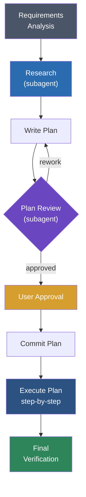
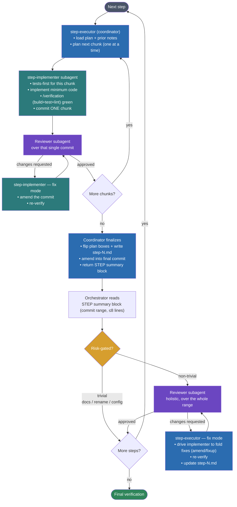

# claude-sweatshop

A Claude Code plugin that orchestrates multi-agent workflows
for day-to-day development. It breaks large tasks into
researched, planned, reviewed, and incrementally implemented
steps — each landing as a series of small, human-readable
commits driven by test-driven development.

Inspired by [superpowers](https://github.com/obra/superpowers).

## Installation

### From the Claude Code marketplace

```bash
claude plugin install POPFD/claude-sweatshop
```

### From source

```bash
git clone git@github.com:POPFD/claude-sweatshop.git
claude plugin install --source ./claude-sweatshop
```

## Getting started

Run the onboard skill in your project to set up the
`.sweatshop/` directory, auto-detect your toolchains (build,
test, lint), and configure the domain expert:

```
/onboard
```

## Usage

### Starting new work

Kick off a feature or significant change with requirements
analysis, which drives the full pipeline:

```
/requirements-analysis Add pagination to the /users API endpoint
/requirements-analysis Fix the race condition in the webhook handler
```

### Individual workflow steps

Use skills directly when you only need a specific part of
the pipeline:

```
/research How does the auth middleware work?
/writing-plans Refactor the database layer to use connection pooling
/requesting-review Check the last commit for issues
/executing-plans Execute the current approved plan
```

### Toolchain skills

Run common dev tasks with auto-detection of your toolchain:

```
/build
/test
/lint
/commit-changes
```

## How it works

The plugin coordinates a pipeline of specialized agents and
skills. The main thread acts as an **orchestrator** — it
delegates heavyweight work (codebase exploration, edits, test
runs) to subagents so context stays clean across long plans.

### Overall pipeline


```mermaid
flowchart TD
    A["Requirements<br/>Analysis"] --> B["Research<br/>(subagent)"]
    B --> C["Write Plan"]
    C --> D{"Plan Review<br/>(subagent)"}
    D -->|rework| C
    D -->|approved| E["User Approval"]
    E --> F["Commit Plan"]
    F --> G["Execute Plan<br/>step-by-step"]
    G --> L["Final<br/>Verification"]

    style A fill:#4a5568,color:#fff
    style B fill:#2b6cb0,color:#fff
    style D fill:#6b46c1,color:#fff
    style E fill:#d69e2e,color:#fff
    style G fill:#2c5282,color:#fff
    style L fill:#2f855a,color:#fff
```

### Per-step execution (orchestrator + subagents)

For each plan step, the main thread orchestrates while
specialized subagents do the work. Step notes
(`.sweatshop/plans/<name>/step-<N>.md`) are the durable
handoff between subagents and survive context compaction.


```mermaid
flowchart TD
    Start(["Next step"]) --> Coord["step-executor (coordinator)<br/>• load plan + prior notes<br/>• plan next chunk (one at a time)"]
    Coord --> Impl["step-implementer subagent<br/>• tests-first for this chunk<br/>• implement minimum code<br/>• /verification (build+test+lint) green<br/>• commit ONE chunk"]
    Impl --> CRev["Reviewer subagent<br/>over that single commit"]
    CRev -->|changes requested| CFix["step-implementer — fix mode<br/>• amend the commit<br/>• re-verify"]
    CFix --> CRev
    CRev -->|approved| More{"More chunks?"}
    More -->|yes| Coord
    More -->|no| Notes["Coordinator finalizes<br/>• flip plan boxes + write step-N.md<br/>• amend into final commit<br/>• return STEP summary block"]
    Notes --> Sum["Orchestrator reads<br/>STEP summary block (commit range, ≤8 lines)"]
    Sum --> Risk{"Risk-gated?"}
    Risk -->|trivial<br/>docs / rename / config| Next
    Risk -->|non-trivial| Review["Reviewer subagent<br/>holistic, over the whole range"]
    Review -->|approved| Next{"More steps?"}
    Review -->|changes requested| Fix["step-executor — fix mode<br/>• drive implementer to fold fixes (amend/fixup)<br/>• re-verify<br/>• update step-N.md"]
    Fix --> Review
    Next -->|yes| Start
    Next -->|no| Done(["Final verification"])

    style Start fill:#4a5568,color:#fff
    style Coord fill:#2b6cb0,color:#fff
    style Impl fill:#2c7a7b,color:#fff
    style CFix fill:#2c7a7b,color:#fff
    style Notes fill:#2b6cb0,color:#fff
    style CRev fill:#6b46c1,color:#fff
    style Review fill:#6b46c1,color:#fff
    style Fix fill:#2b6cb0,color:#fff
    style Risk fill:#d69e2e,color:#fff
    style Done fill:#2f855a,color:#fff
```

The `step-executor` coordinator (blue) plans the step's commits
one chunk at a time and dispatches a `step-implementer` (teal)
for each one; the `reviewer` (purple) reads each committed chunk
in its own context. All three run in isolated contexts — diffs
and test output never enter the main thread, which sees only the
coordinator's compact summary (the commit range and a one-line
result).

### 1. Requirements analysis

New features start with a structured dialogue. The plugin
surveys the project, evaluates the task against constraints
(performance, scalability, security, compatibility), and asks
focused questions one at a time to fill gaps. It then
compares viable approaches with trade-offs and walks through
the design piece by piece. No code is written until the user
explicitly approves the design.

### 2. Research

The researcher agent investigates both the codebase and
external sources. It searches for relevant code, patterns,
architecture, dependencies, prior art, documentation, best
practices, and known pitfalls. The output is a structured
report covering task understanding, codebase findings,
external findings, and recommendations.

### 3. Planning

Work is broken into small, incremental, decoupled steps —
each landing during execution as a coherent series of small,
reviewable commits. Every step includes a description,
rationale, acceptance criteria (as checkboxes), and a list of
files likely involved. Each plan gets its own directory —
`.sweatshop/plans/<plan-name>/plan.md`, with per-step notes
(`step-<N>.md`) landing alongside it during execution — and is
reviewed, approved, and committed before execution begins.

### 4. Review (plans and code)

Plans and non-trivial code steps go through a single
`reviewer` agent run that produces both a general code
review and (when in scope) a domain review in one
exploration pass. The mode is picked per-invocation:

- **`code-only`** — used when the diff is docs-only,
  test-only, a pure rename/format refactor, or changes only
  files outside the configured `domain.paths`. Produces a
  principal-engineer code review covering design,
  performance, scalability, and alignment with research.
- **`code+domain`** — used when any changed file matches
  `domain.paths` (or, in fallback mode, when domain-specific
  invariants are plausibly affected). Adds a domain section
  driven by the `focus_areas` configured during onboarding
  (e.g., crypto/DeFi, frontend, ML, distributed systems).

Review happens at two altitudes. The `step-executor`
coordinator reviews **each commit as it lands** — dispatching
the `reviewer` over that single commit and, on changes, sending
the `step-implementer` back in fix mode to fold the fix into the
same commit with `git commit --amend` before moving on. Then the
orchestrator runs **one holistic review over the whole step
range** as a cross-commit backstop. Trivial steps (pure docs,
mechanical renames, config-only edits with no runtime effect)
skip the holistic pass entirely. If that verdict requests
changes, the `step-executor` is re-dispatched in **fix mode** —
it drives the implementer to fold the fixes into the existing
commits (amend, or fixup+autosquash for an earlier commit),
never as new commits, and re-runs verification before re-review —
up to 3 iterations before escalating to the user.

### 5. Execution (orchestrator + subagents, TDD per step)

The `/executing-plans` skill walks the plan one step at a
time, strictly in plan order. The main thread is an
**orchestrator** — it never implements directly. Per step:

1. **`step-executor` coordinator** runs the step in its own
   context but writes no code itself: it loads `plan.md` and the
   prior step's notes (walking further back only when a note
   points there), then plans the step's commits **one chunk at a
   time** (one idea per chunk, 2–5 chunks). For each chunk it
   dispatches a **`step-implementer` subagent** that writes the
   chunk's tests first, implements the minimum code, runs
   `/verification` (build + test + lint) until that single
   commit is green, and commits exactly that one chunk. The
   coordinator then dispatches the `reviewer` over that one
   commit and, on changes, sends the implementer back in fix
   mode to amend it — so every commit is verified and reviewed in
   isolation before the next chunk is planned. After the final
   chunk, the coordinator flips the plan's `- [ ]` boxes, writes
   the step-notes file, and folds both into the final commit so
   the step lands atomically.
2. **Orchestrator reads only the coordinator's STEP summary
   block** — the commit range and a one-line result. Diffs and
   test output stay out of the main thread.
3. **Risk-gated holistic review** — the per-commit reviews are
   done; this is the cross-commit backstop. The orchestrator
   skips it for trivial steps; otherwise dispatches the
   `reviewer` agent (with the mode chosen from `domain.paths`)
   over the step's whole committed range.
4. **Fix mode** — on blocking feedback the `step-executor` is
   re-dispatched and drives the implementer to fold the fixes
   into the existing commits (amend, or fixup+autosquash for an
   earlier commit) rather than adding new ones, re-verifies, and
   updates the step-notes "Review resolutions" section. Then
   re-review. Max 3 cycles.

Step notes are the durable handoff: they survive context
compaction, so a fresh session mid-plan can re-orient just
by listing `step-*.md` files. If a step is blocked or fails
review repeatedly, execution stops and the issue is
surfaced — no further steps run until the plan is adjusted
and re-approved.

### 6. Verification

After all steps complete, a final verification pass runs
build, test, and lint against the full project, confirms
every acceptance criterion is checked off, and verifies no
uncommitted changes remain.

## Agents

| Agent | Role |
|-------|------|
| `researcher` | Deep-dives into the codebase and external sources to build task context |
| `reviewer` | Principal-engineer code review plus per-project domain review in a single pass |
| `step-executor` | Coordinates one plan step: plans commits one chunk at a time, dispatches an implementer per chunk, reviews each commit, writes notes — in an isolated context |
| `step-implementer` | Implements exactly one commit (one chunk) per dispatch — tests-first, build/test/lint green — and has a fix mode that amends it |

## Skills

| Skill | Description |
|-------|-------------|
| `/onboard` | Sets up `.sweatshop/`, detects toolchains, and configures the domain expert |
| `/requirements-analysis` | Structured dialogue to surface requirements before any implementation |
| `/research` | Dispatches the researcher agent for deep codebase and external context |
| `/writing-plans` | Breaks work into small steps with acceptance criteria |
| `/executing-plans` | Walks through an approved plan step by step with TDD and review gates |
| `/requesting-review` | Dispatches the reviewer with code-only or code+domain mode based on the diff |
| `/verification` | Runs build, test, lint and confirms all acceptance criteria are met |
| `/build` | Auto-detects the build system and runs it |
| `/test` | Auto-detects the test framework and runs tests |
| `/lint` | Auto-detects the linter and runs it |
| `/commit-changes` | Stages and commits with conventional message formatting and signoff |

## Toolchain auto-detection

The `/onboard`, `/build`, `/test`, and `/lint` skills
auto-detect your project's toolchain by checking for config
files in priority order. Detected commands are cached in
`.sweatshop/memory.json` with a config file hash so
re-detection only happens when your config changes. Domain
configuration (type, focus areas, review criteria) is stored
separately in `.sweatshop/domain.json` and checked into
version control.

Supported build systems: Make, Cargo, npm/yarn/pnpm, Go,
.NET, Gradle, Maven, CMake, Meson.

Supported test frameworks: make test, cargo test, npm test,
go test, dotnet test, gradle test, mvn test, pytest.

Supported linters: make lint, cargo clippy, npm run lint,
golangci-lint, dotnet format, gradle check, mvn checkstyle,
ruff, flake8, pylint.

## License

MIT — see [LICENSE](LICENSE).
